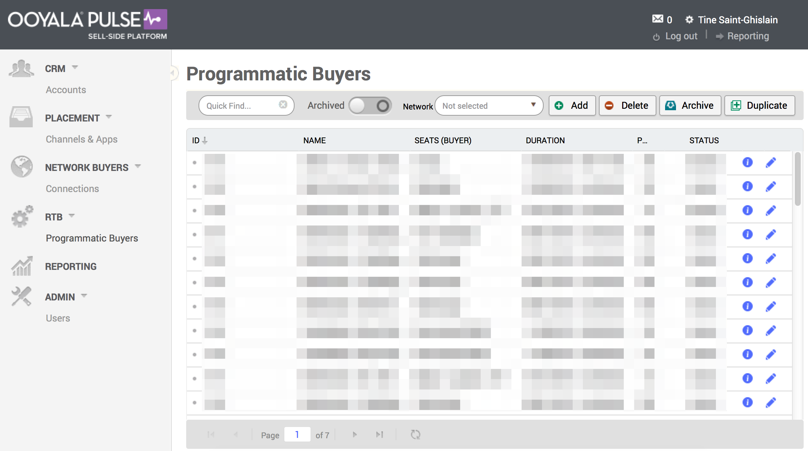

# 2015-08-14 Release

Videoplaza is now Ooyala

## Videoplaza is now Ooyala

We have joined forces with Ooyala to create the world’s leading personalized TV and video platform. While the Videoplaza name goes away, rest assured that our goal is the same today as when we founded Videoplaza in 2007: to maximize the value of your audience.

## Ooyala Pulse

Karbon is renamed to **Ooyala Pulse**, and the interface is rebranded with the new name, logos and color scheme. All functionality has stayed the same as before the rebranding.

## Ooyala Pulse SSP

Konnect is renamed to **Ooyala Pulse Sell-Side Platform**, or **Ooyala Pulse SSP**, and the interface is rebranded with the new name, logos and color scheme. All functionality has stayed the same as before the rebranding.

## Documentation Releases

This release includes the following documentation updates and additions:

-   All user documentation and developer tutorials have moved to help.ooyala.com.

    These are the current locations:

    -   **User and developer documentation:** the [Video Advertising](../about_ad_solutions.md) page is the starting point of this documentation.
    -   **Video tutorials**: the video tutorials can be found [here](http://help.ooyala.com/video-tutorials), under Video Advertising.
    All Video Advertising SDK documentation is still available at the same location [here](http://pulse-sdks.ooyala.com/).

**Parent topic:**[2015 Video Advertising Release Notes](../../oadtech/relnotes/adtech_relnotes_2015.md)

