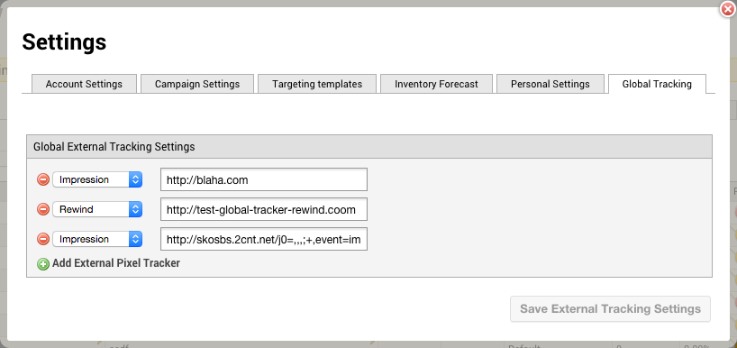
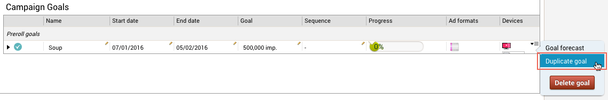
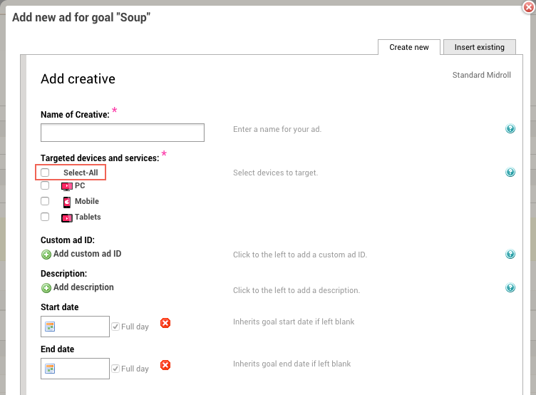

# 2016-01-11 Release

Pulse Ad Serving improvements

## Global tracking pixel

External tracking by systems other than the Pulse tracking, has been available on a per-ad basis to satisfy the advertiser's 3rd party tracking needs. Now, customers/publishers also have the ability to set up external tracking over all their campaigns and ads, through the global tracking pixel. All events available in Pulse, for example impressions, clicks and quartiles, can be tracked in this way.

All added global tracking pixels work retroactively, which means that the tracking is applied to all ads that were already active before the tracker was added.

To start using this feature, open the Settings in Pulse, select the Global Tracking tab, and click **Add External Pixel Tracker**. The URLs may contain macros, which are described on the Ooyala Pulse Macros page.

## Duplicating goals

Pulse now offers you the ability to duplicate goals within a campaign. The duplicate goal:

-   has the same attribute values, like start and end date, as the original,
-   contains the same ads as the original,
-   and the ads are automatically inactivated to prevent the goal from running immediately.

The name of the duplicate goal is set as *original goal name - Copy*, but can be changed before actually duplicating the goal.

## Select-All devices option for Ad creation

The new **Select-All** option in the **Add new ad for goal "XXX"** page enables you to select all device and service categories defined for your account in one go. Selecting this option marks all other categories automatically, which may be particularly handy if you need to exclude only one option.

## Documentation Releases

This release includes the following documentation updates:

Global Tracking section added to [Settings](../ad_serving/ug/settings.md).

## Subscribe to Ooyala Release Notes

See [Subscribe to Ooyala Release Notes](../../concepts/release_notes_subscribe.md) for instructions on how to subscribe for automated notifications of Ooyala release notes.

**Parent topic:**[2016 Video Advertising Release Notes](../../oadtech/relnotes/adtech_relnotes_2016.md)

