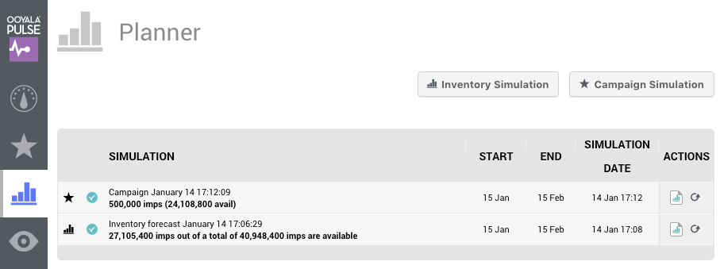
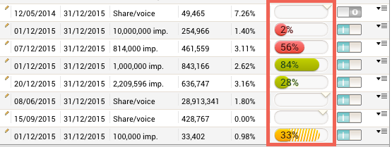

# 2016-01-15 Release

Pulse new and improved forecasting functionality

## New Planner with Improved Forecasting

**Warning:** The following features are not automatically rolled out to all customers! A staged rollout plan is being created and customers will be notified well in advance of when they are scheduled to transfer to the new planner and forecasting.

**New Planner**

The planner enables you to simulate inventory and campaign delivery. The planner runs inventory forecasts, which are predictions of future conditions based on past and present data.

Now, with the new planner, you can:

-   simulate inventory separately from campaign simulations.
-   have multiple simulations.
-   create new simulations based on the parameters of an older simulation in the list.

The campaign simulation reports, specifically, give you information about all the competing campaigns. This list contains links directly to the competing campaigns to easily adjust them if necessary.

**Improved Forecasting**

The new planner also uses a new forecasting engine, which employs a simulation based forecasting approach, as opposed to a calculation or mathematical model based approach. This means that the forecasting engine simulates ad delivery by fast-forwarding the same ad decisioning engine, which will later deliver the ads, through a future inventory based on historical user data. The result is more realistic and accurate than a traditional calculation or mathematical model based approach.

**Campaign & Goal Progress Bar**

The new forecasting engine is also used for projecting delivery for running campaigns and goals and is visualised on the Campaign Overview page in the form of the progress bar on each campaign and goal.

## Documentation Releases

This release includes the following documentation updates:

For more information about the new planner and forecasting engine, refer to [Planner](../ad_serving/ug/planner_introduction_forecasting.md) in the [Ooyala Pulse User Guide](../ad_serving/ug/introduction.md).

## Subscribe to Ooyala Release Notes

See [Subscribe to Ooyala Release Notes](../../concepts/release_notes_subscribe.md) for instructions on how to subscribe for automated notifications of Ooyala release notes.

**Parent topic:**[2016 Video Advertising Release Notes](../../oadtech/relnotes/adtech_relnotes_2016.md)

