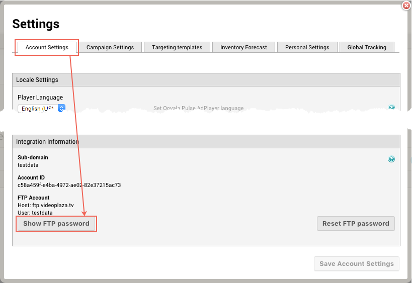

# 2016-01-21 Release

tvOS and iOS SDK contain bitcode, new customer portal, and more ...

## tvOS and iOS SDK Contain Bitcode

To be able to release tvOS applications on the Apple Store you are required to include bitcode in your app binary. Any libraries the application uses must also include bitcode. From v2.1.16.1.1 onward, the tvOS SDK contains bitcode.

Although the same requirement does not apply to iOS applications, from v2.1.16.1.1 onward, the iOS SDK also contains bitcode.

For more information about bitcode, refer to the following Apple Developer article: [https://developer.apple.com/library/tvos/documentation/IDEs/Conceptual/AppDistributionGuide/AppThinning/AppThinning.html](https://developer.apple.com/library/tvos/documentation/IDEs/Conceptual/AppDistributionGuide/AppThinning/AppThinning.html)

## New Customer Portal

The Ooyala Support team is pleased to announce the release of our new [Customer Portal](http://help.ooyala.com/contact), unifying support portals across Ooyala's products. The old Zendesk support portal will be phased out completely by February 15th, 2016.

For more information regarding the new portal, and how to sign up, refer to the following article: [http://community.ooyala.com/t5/Information-News/Our-new-Support-Portal-is-now-available/td-p/7908](http://community.ooyala.com/t5/Information-News/Our-new-Support-Portal-is-now-available/td-p/7908)

## New Macro for Ad URL

Macros are used in the Pulse UI when adding third party tags and external tracking links. The macros are resolved into values when the tags or links are added to an ad response.

A new macro, called \[ad.sourceURL\], is available, which enables you to send the precise URL of a served ad to any external tracking system. This URL, in turn, allows you to view the ad for verification or classification purposes without generating tracking events.

## Hide FTP Password in Pulse UI

The FTP password on the Account Settings tab in the Settings window is now hidden by default to further improve our SOC2 compliance. To view the password, click the **Show FTP password** button.

## Fix for Underestimation in Inventory Simulation

Due to a bug in how inventory was simulated using the new forecasting engine, certain customers who have a larger number of positions \(4 or more\) for ads in their ad breaks were seeing too low numbers of total, used, and available inventory. This bug is now fixed and will result in seeing more total, used, and available inventory when running simulations. The increase in total inventory may be up to 400% of previously simulated numbers, depending on your account settings and simulation parameters. The increases in used and available may be more dramatic and can range up to 10 times previous forecasts.

Affected customers may be those who:

-   are using the new forecasting engine already.
-   have set a larger number of positions \(4 or more\) for ads in their ad breaks.

For more information regarding the release and roll out of the new planner and associated new forecasting engine, refer to [New Planner with Improved Forecasting release note](2016-01-15.md#).

## Documentation Releases

This release includes the following documentation updates:

Refer to the Changelog Document for tvOS and iOS SDKs at: [http://pulse-sdks.ooyala.com/ios\_2/latest/docs/Changelog.html](http://pulse-sdks.ooyala.com/ios_2/latest/docs/Changelog.html)

For more information about macros, refer to the following Community Knowledge Base article: [Ooyala Pulse Macros](http://community.ooyala.com/t5/Ad-Products-Knowledge-Articles/Ooyala-Pulse-Macros/ta-p/7041)

## Subscribe to Ooyala Release Notes

See [Subscribe to Ooyala Release Notes](../../concepts/release_notes_subscribe.md) for instructions on how to subscribe for automated notifications of Ooyala release notes.

**Parent topic:**[2016 Video Advertising Release Notes](../../oadtech/relnotes/adtech_relnotes_2016.md)

