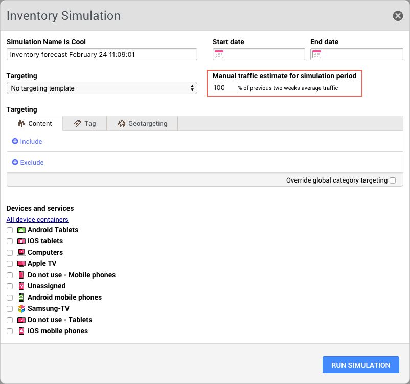

# 2016-02-25 Release

Manual traffic estimates for inventory simulations.

## Manual Traffic Estimates for Inventory Simulations in the New Planner

**Warning:** The following feature is not automatically rolled out to all customers! A staged rollout plan is in operation for the new planner and customers will be notified well in advance of when they are scheduled to transfer to the new planner and forecasting.

A new field, called **Manual traffic estimate for simulation period**, is available on the **Inventory Simulation** creation window. It is used to enter a multiplier which is applied to the average traffic sample taken from the traffic recorded for your whole site in the previous two weeks.

The field allows you to run inventory simulations with a correction on your traffic numbers, for time periods where you expect a deviation in traffic compared to the normal traffic to your site. For example, when you expect an increase in traffic due to a popular TV show coming back on, or a decrease in traffic due to holiday seasons, you are able to run an inventory simulation for these periods with a manual estimate of the traffic in relation to your normal traffic pattern from the past two weeks.

The default value is 100% and a value higher than the default value means you expect an increase in traffic.

The differences you see in the **Used inventory** numbers in the inventory simulation report could be due to a combination of Share of Voice goals and impression goals that may or may not be satisfied otherwise, for example when you are oversold on a certain category.

The limitations on this new feature are:

-   Any integer value between 1 and 500 may be entered in the field.
-   Running inventory simulations on narrow targets with an estimated decrease in traffic is not recommended, because the average traffic sample without the correction will already contain few relevant records. The result of such an inventory simulation may not reflect reality.

## Documentation Releases

This release includes the following documentation updates:

[Create Inventory Simulation](../ad_serving/ug/planner_create_inventory_simulation.md)

## Subscribe to Ooyala Release Notes

See [Subscribe to Ooyala Release Notes](../../concepts/release_notes_subscribe.md) for instructions on how to subscribe for automated notifications of Ooyala release notes.

**Parent topic:**[2016 Video Advertising Release Notes](../../oadtech/relnotes/adtech_relnotes_2016.md)

