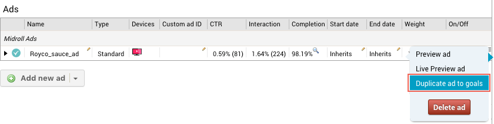

# 2016-03-23 Release

Duplicating ads between goals, HTML5 Ad Player, additional events supported from VAST, Pulse SDK developer documentation.

## Duplicating Ads Between Goals

A new option is available on the ad overview to duplicate an ad to goals within its campaign. This functionality allows you to quickly set up additional goals which use ads already present in the campaign. For example, you created a goal to run for a specific period at a premium location in the ad breaks \(first place\) and the advertiser wants to buy additional inventory, but this time the premium location is not necessary. In this case, you may set up a goal with a lower price and use the ad duplication functionality to simply copy over the ads.

To use the functionality, click the menu of the ad you want to duplicate and select **Duplicate ad to goals**.

For more information about duplicating ads, refer to [Duplicate Ad to Goals](../ad_serving/ug/ad_overview.md#duplicate_ad_to_goals).

## HTML5 Ad Player

Ooyala now offers an HTML5 ad player to very quickly integrate your web based video player with Ooyala Pulse for ad serving. This ad player allows you to show:

-   Linear ads \(pre-, mid-, and post-rolls\).
-   VPAID 1.0 ads through an automatic swith to the integrated Flash player.
-   VPAID 2.0 ads through the default HTML5 player.

An integration with the HTML5 ad player is event driven, like an integration with the full Pulse SDKs, but also simpler because the ad selection, ad playback, ad tracking and error handling are all taken care of for you. Another added advantage of this ad player is the seamless switch to a Flash player for the playback of VPAID 1.0 ads.

If you do not want to or cannot use Flash, you can configure your ad player to use HTML5 only. VPAID 1.0 ads are not shown in this case.

For more information, refer to [HTML5 Pulse 2.x SDK](http://pulse-sdks.ooyala.com/pulse-html5/latest/).

## More Interactive Events Available in VAST response

Tracking URLs for the following interactive events are now also present in the VAST responses from Ooyala Pulse:

-   **Pause**: the user pauses ad playback.
-   **Rewind**: the user rewinds an ad.
-   **Resume**: the user resumes ad playback after they paused it.
-   **Fullscreen**: the user makes the video player full screen during video playback.

This allows reporting the events to Ooyala Pulse and pull reports on the events from Ooyala Pulse.

For more information regarding the VAST events, refer to [Appendix: Guide to Events and Params](../ad_serving/dg/validation_appendix.md).

## Pulse SDK Additional Developer Documentation

More information about the Pulse SDKs, our newest range of SDKs to integrate your video players with Ooyala Pulse for ad serving, is now available on the Ooyala Support portal. This information includes:

-   what features are supported for each Pulse SDK
-   where you can find the resources for each Pulse SDK
-   an example of the communication between the application and the Pulse SDK
-   a generic tutorial of how to implement an integration

Pulse SDKs are available for:

-   Android
-   iOS
-   tvOS
-   HTML5

The new Pulse SDK developer documentation can be found here: [Pulse SDKs](../ad_serving/dg/pulse_sdks_intro.md).

## Documentation Releases

This release includes the following documentation updates:

-   For duplicating ads between goals: [Duplicate Ad to Goals](../ad_serving/ug/ad_overview.md#duplicate_ad_to_goals)
-   For the new HTML5 ad player: [HTML5 Pulse 2.x SDK](http://pulse-sdks.ooyala.com/pulse-html5/latest/)
-   For the tracking events in VAST: [Appendix: Guide to Events and Params](../ad_serving/dg/validation_appendix.md)
-   For the new Pulse SDK documentation: [Pulse SDKs](../ad_serving/dg/pulse_sdks_intro.md)

## Subscribe to Ooyala Release Notes

See [Subscribe to Ooyala Release Notes](../../concepts/release_notes_subscribe.md) for instructions on how to subscribe for automated notifications of Ooyala release notes.

**Parent topic:**[2016 Video Advertising Release Notes](../../oadtech/relnotes/adtech_relnotes_2016.md)

