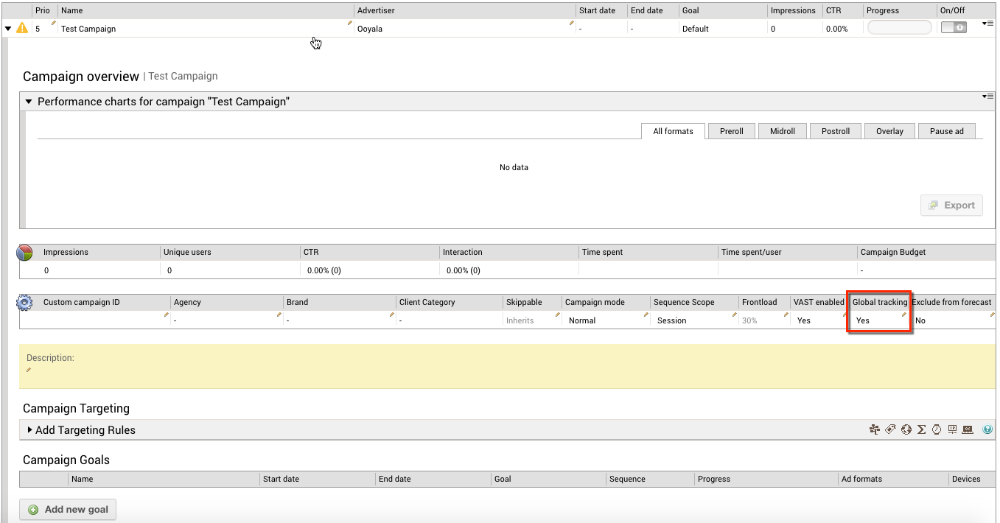

# 2016-04-28 Release

Disable global external tracking for a campaign.

## Disable global external tracking for a campaign

A new option is available on the Campaign overview to disable global external tracking for individual campaigns. If you have set up global external pixel trackers, they are enabled by default for all campaigns. To use the new option, go to the desired campaign's overview, double-click the pen icon and change the **Global tracking** setting.

## Documentation Releases

This release includes the following documentation updates:

-   [Campaign Overview](../ad_serving/ug/campaign_overview.md)

## Subscribe to Ooyala Release Notes

See [Subscribe to Ooyala Release Notes](../../concepts/release_notes_subscribe.md) for instructions on how to subscribe for automated notifications of Ooyala release notes.

**Parent topic:**[2016 Video Advertising Release Notes](../../oadtech/relnotes/adtech_relnotes_2016.md)

