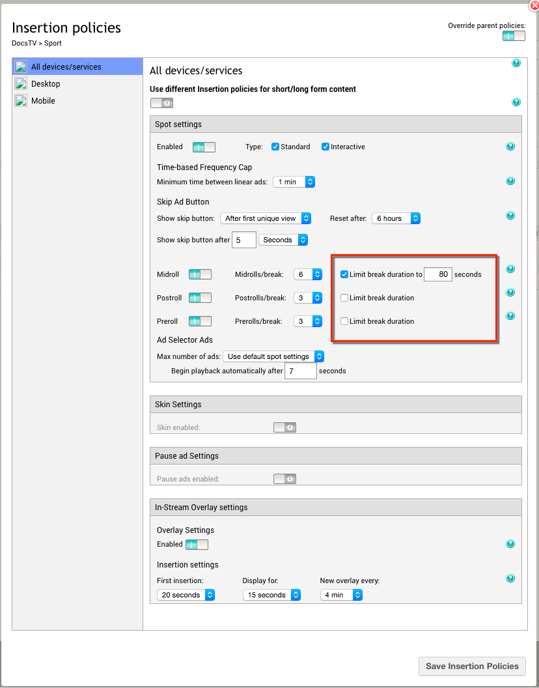
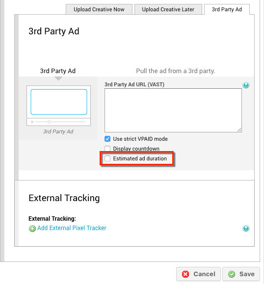

# 2016-05-19 Release

Ability to limit the maximum duration of an ad break, new JW7 HTML5 plugin and new VideoJS HTML5 plugin.

## Time Based Breaks

Previously, Ooyala Pulse only enabled you to set a specific number of ads to serve for position based breaks \(pre-, mid- and post-rolls\). Now, you can combine this setting with an explicit time constraint, defining the maximum duration of the ad break.

For example, you have defined a mid-roll break to show 6 ads. If each ad is 20 seconds long, the viewer has to watch 2 minutes of advertising before their chosen content resumes playback. From your own statistics, you may know that the maximum length of advertising you can show in a break and still keep viewers engaged is 80 seconds. When you set the break duration limit to 80 seconds, instead of showing the 6 mid-roll ads, you show as many mid-roll ads as you can in 80 seconds, for example one 30 second ad, one 20 second ad, and two 15 second ads. The maximum number of ads you can show is still 6, but the ad break ends when it reaches the specified duration, or when all its slots are filled, whichever happens first.

Limiting ad break duration helps to increase viewer retention, and in turn increase your inventory because your viewers are more likely to return to your site and start more videos.

To start using this feature, contact your Account Manager. When the feature is enabled for your Pulse account, you can set ad break duration limits in your insertion policies.

The limitations of the new feature are:

-   It guarantees that ad breaks are not longer than the time you set, but it does not guarantee the complete duration limit is filled with ads.
-   Ads that are too long \(exceed the defined duration limit of the break\) are not eligible for time based breaks and will not get selected.
-   The forecasting engine does not take time based breaks into account. It always assumes that the maximum number of impressions is available, even though fewer ads might be shown in time based breaks. The example above illustrates this limitation: the maximum number of mid-rolls is set to 6 and the break is limited to 80 seconds, but only 4 ads were shown when the time limit was reached. This limitation affects campaign and inventory forecasts, and the projected delivery of running campaigns and goals.
-   You have to **specify the estimated duration of 3rd party ads** to make them eligible for time based breaks. If the ad exceeds the duration limit of the break, it will not get selected. There is a new option available on the "Add new 3rd party ad" page, to estimate the duration of the 3rd party ad:

## New JW7 HTML5 Plugin

A new plugin is available to integrate your JW Player version 7.x with Ooyala Pulse for ad serving. This plugin, based on the HTML5 ad player, enables you to create a fast and simple integration, because it automatically takes care of:

-   ad selection,
-   ad playback,
-   ad tracking and error handling,
-   and handling VPAID 1.0 and VPAID 2.0 ads.

The plugin and all its documentation can be found on GitHub: [Ooyala Pulse plugin for JW7](https://github.com/ooyala/pulse-sdk-html5-2.x-plugin-jw7).

## New VideoJS HTML5 Plugin

A new plugin is available to integrate your VideoJS Player version 5.x and higher with Ooyala Pulse for ad serving. Like the plugin for JW7 Player, this plugin, based on the HTML5 ad player, enables you to create a fast and simple integration, because it automatically takes care of:

-   ad selection,
-   ad playback,
-   ad tracking and error handling,
-   and handling VPAID 1.0 and VPAID 2.0 ads.

The plugin and all its documentation can be found on GitHub: [Ooyala Pulse plugin for VideoJS](https://github.com/ooyala/pulse-sdk-html5-2.x-plugin-videojs).

## Documentation Releases

This release includes the following documentation updates:

-   For the ad insertion policies: [Ad Insertion Policies](../ad_serving/ug/ad_insertion_policies.md)
-   For the 3rd party ad settings: [3rd Party Ad](../ad_serving/ug/upload_creative.md#3rd_party_ad)
-   For the JW7 HTML5 plugin: [JW7 HTML5 Plugin](../ad_serving/dg/plugin_jw7_html5.md)
-   For the VideoJS HTML5 plugin: [VideoJS HTML5 Plugin](../ad_serving/dg/plugin_videojs_html5.md)

## Subscribe to Ooyala Release Notes

See [Subscribe to Ooyala Release Notes](../../concepts/release_notes_subscribe.md) for instructions on how to subscribe for automated notifications of Ooyala release notes.

**Parent topic:**[2016 Video Advertising Release Notes](../../oadtech/relnotes/adtech_relnotes_2016.md)

