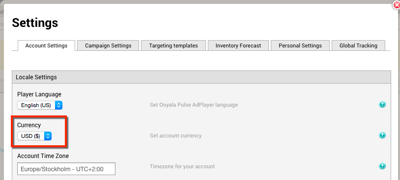

# 2016-08-11 Release

New currencies added to Ooyala Pulse Account Settings.

## New currencies available in Ooyala Pulse

The currency list in Pulse Account Settings has been extended. Now you can select any of the following currencies as well:

-   AUD \(Australian Dollar\)
-   BRL \(Brazilian Real\)
-   CAD \(Canadian Dollar\)
-   JPY \(Japanese Yen\)
-   KRW \( South Korean Won\)
-   MXN \(Mexican Peso\)
-   NZD \(New Zealand Dollar\)
-   PHP \(Philippine Peso\)
-   ZAR \(South African Rand\)

This enables more clients to use their own currency for working with campaign budgets and reports. To select the currency for your Ooyala Pulse account, go to the **Settings** tab as shown below:

## Subscribe to Ooyala Release Notes

See [Subscribe to Ooyala Release Notes](../../concepts/release_notes_subscribe.md) for instructions on how to subscribe for automated notifications of Ooyala release notes.

**Parent topic:**[2016 Video Advertising Release Notes](../../oadtech/relnotes/adtech_relnotes_2016.md)

