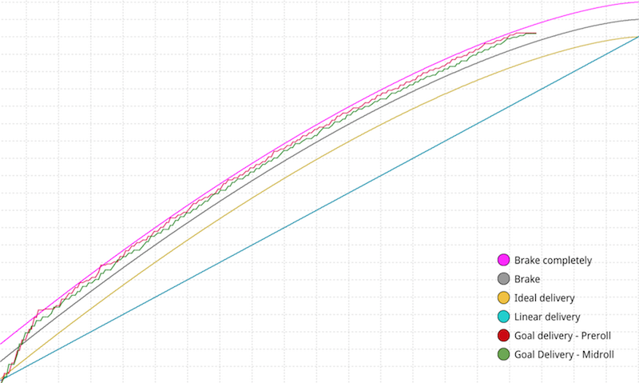
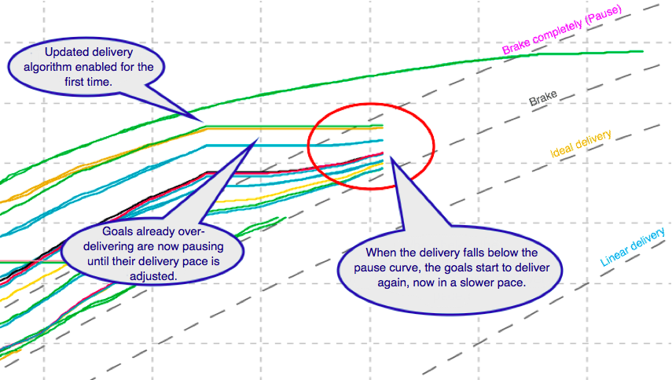

# 2016-09-01 Release

Pulse internal delivery algorithm update, new ad request parameter, Android Pulse SDK session extension, HTML5 Pulse SDK debugging.

## Pulse Delivery Algorithm Update

**Attention:** The updated delivery algorithm is enabled by default for all customers.

The limitations of the updated delivery algorithm are:

-   The update applies only to impression goals with an end date that are over-delivering.
-   The current forecasting engine does not take the delivery algorithm update into account.

The Pulse Distribution Engine uses a delivery algorithm which takes numerous pieces of data into account when deciding which goal to pick and which ad to display. All impression goals with an end date in Pulse should deliver according to an ideal delivery curve to ensure an even distribution and at the same time safeguard against over- and under-delivery. The ideal delivery curve has a built in safety margin which prevents under-delivery at the end of a goal's lifetime and goals strive to be as close to this ideal delivery curve as possible. The most common reason for over-delivery is changing the goal configuration during its lifetime, for example extending the goal's lifetime or lowering the delivery goal.

Previously, goals experiencing over-delivery issues finished ahead of schedule, which means no ads were displayed during the remainder of the goal's lifetime. Now, the delivery algorithm includes a brake and pause functionality which slows down the goal delivery or completely stops it, depending on how far ahead it is from the ideal delivery curve.

With the updated delivery algorithm enabled, goals experiencing over-delivery issues first brake and eventually pause until their delivery pace is adjusted. Ads are not displayed during the pause period, however they are displayed after the goal delivery adjusts and until the end of the goal's lifetime.

The image below shows a goal constantly over-delivering and therefore hovering around the upper boundary where the delivery is paused.

-   **Brake**: when the goal is between the grey "Brake" curve and pink "Brake completely" curve, Pulse brakes the goal in a way that it still delivers, but at a slower pace.
-   **Pause**: when the goal is above the pink "Brake completely" curve, Pulse completely pauses the delivery and waits for the goal to fall under the pink curve so it can start delivering again.

**Note:** The brake and pause margins are adjustable for each account. By default, Pulse brakes the delivery when it is 5% over the ideal delivery curve and it completely pauses the delivery when it is 10% above the ideal delivery curve. Please contact your Account Manager to set the desired margins for your account.

**Warning:**

-   With the updated delivery algorithm enabled for the first time, goals that are far ahead of their delivery schedule are paused for a short period in order to adjust their delivery pace. This means that no ads from these goals are displayed during the pause period.

    The length of the pause period depends on the goal's lifetime and how far ahead of the delivery schedule the goal is. Short \(1 day to 1 week\) and semi-short goals \(2 to 4 weeks\) are most likely to be paused because it is harder to pace them and match traffic patterns. After the goals adjust, there should not be any over-delivery issues and no pause periods.

    The image below shows how enabling the updated delivery algorithm affects goals that were already 10% and more above the ideal delivery curve.

    

-   With the updated delivery algorithm enabled, you should not manually adjust goal settings in order to prevent over-delivery, for example lower the delivery goal or shorten the goal's lifetime. That could cause adverse effects, as the algorithm tries to adapt to changing parameters while simultaneously trying to prevent over-delivery.

## Tracking Scheme Ad Request Parameter

Previously, when making an ad request through HTTP or HTTPS, you could not change the protocol in the generated tracking links, which was the same as the protocol in the original request. Now, with the new `trs` parameter, you can override the scheme used to generate the tracking links in an ad response.

## Session Extension in Android Pulse SDK

From versions 2.3.16.17.0, the Android Pulse SDK supports session extension. This means that you can add more points during the video content to play ads, with the following limitations:

-   You cannot request insertion points that have been requested already. For example, if you have already requested post-roll ads, then you cannot request them again.
-   You can request additional mid-rolls, but only for cue points that have not been requested yet. For example, if you have already requested midrolls to show after 10 seconds and 30 seconds of video content playback, you can only request more midrolls for times that differ from 10 and 30 seconds.
-   You may request pause ads multiple times, but the selected pause ad is always the last one requested. This means that the pause ad insertion point is always overwritten with the latest result from the session extension.

The main use case for session extension is the ability to insert ads in live streams.

## Debug Logs in HTML5 Pulse SDK

To facilitate debugging while implementing the integration between your web based video player and Pulse, the HTML5 Pulse SDK now offers the pulse\_debug query parameter. Add this parameter immediately to the page's query string parameters where you want to enable debugging. For example, mysite.com/mypage?pulse\_debug activates debugging on mysite.com/mypage.

## Documentation Releases

This release includes the following documentation updates:

-   For more information on how the Pulse Distribution Engine works, refer to the following Community Knowledge Base article: [Pulse Distribution Engine](http://community.ooyala.com/t5/Adtech-Knowledge-Articles/Pulse-Distribution-Engine/ta-p/8780)
-   For the new ad request parameter: [Appendix: Guide to Events and Params](../ad_serving/dg/validation_appendix.md)
-   For session extension in Android Pulse SDK: [Changelog](http://pulse-sdks.ooyala.com/android_2/latest/changelog/) and [Pulse SDKs](../ad_serving/dg/pulse_sdks_intro.md)

## Subscribe to Ooyala Release Notes

See [Subscribe to Ooyala Release Notes](../../concepts/release_notes_subscribe.md) for instructions on how to subscribe for automated notifications of Ooyala release notes.

**Parent topic:**[2016 Video Advertising Release Notes](../../oadtech/relnotes/adtech_relnotes_2016.md)

