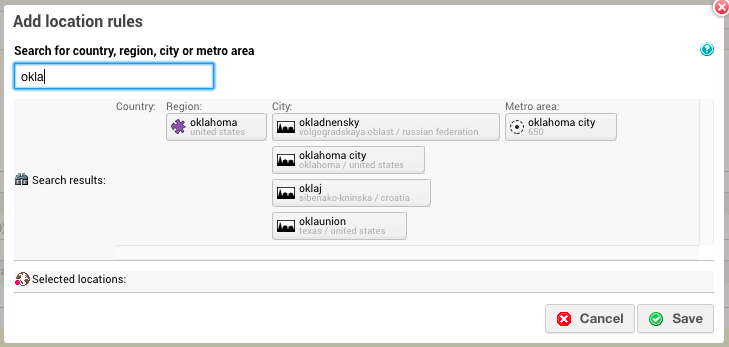
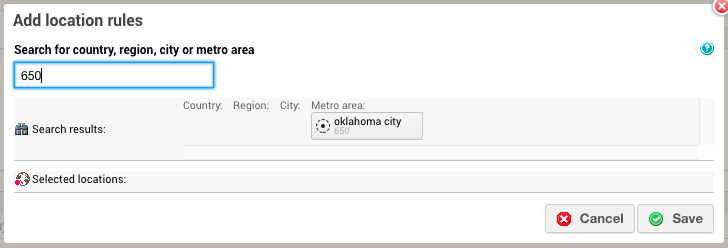

# 2016-09-15 Release

Metro area targeting \(US DMA regions included\) and overlay ads in HTML5 ad player.

## Metro Area Targeting

**Tip:** CSS changes have been made to the **Add location rules** page so make sure to clear your browser cache in order to see the new layout.

**Attention:** This feature is not enabled by default. Please contact your Account Manager if you want to use this feature.

**Limitation**: Reporting on metro areas is not available at the moment.

Previously, you could use geotargeting to allow or deny viewers from selected countries, regions and/or cities. Now, with the extended geotargeting capability, you can target metro areas as well \(US DMA regions included\).

A metro area refers to the metropolitan area where your target viewers are located. This comprises the densely populated urban core and its less populated surrounding territories, sharing industry, infrastructure, and housing. Metro area targeting provides you with more precise targeting in case your business does not serve all regions or cities, or your advertising efforts focus on certain areas within a country.

Metro area codes include:

-   **Designated Market Areas \(DMA’s\) in the United States of America** - A DMA region is a group of counties that form an exclusive geographic area in which the home market television stations hold a dominance of total hours viewed. There are 210 DMA regions, covering the entire continental United States, Hawaii, and parts of Alaska.
-   **ITV regions in the United Kingdom** - ITV is the oldest commercial television network in the UK and is responsible for the commissioning, scheduling and marketing of network programs on ITV1. Additionally, ITV is responsible for advertising sales on ITV1 across the UK.
-   **Department Codes in France** - The department is one of the three levels of government below the national level, between the regions and commune. There are 96 departments in metropolitan France and five overseas departments, which are also classified as regions.
-   **German Nielsen TV Markets** - The metro codes for Germany reflect the Nielsen TV markets \(Nielsengebiete\).
-   **South Korean Si/Gun/Gu** - The metro codes for South Korea use the municipal level divisions si \(city\), gun \(county\), and gu \(district\).
-   **Chinese Diji Shi Cities** - The metro codes for China use the diji shi administrative definition of prefecture-level cities administered at the provincial level and also include the four provincial-level cities or zhixia shi \(Beijing, Tianjin, Shanghai, Chongqing\) administered by the Central Government.
-   **Russian Federal Districts** - The metro codes for Russia are based on the nine Russian Federal Districts.
-   **Norwegian municipalities** - The metro codes for Norway are based on the Norwegian municipalities, most commonly referred to as “Kommune”.
-   **Canadian census metropolitan areas \(CMAs\) and census agglomerations \(CAs\)** - The metro codes for Canada include 33 CMAs and 114 CAs as defined by Statistics Canada.
-   **Urban areas in New Zealand** - The metro codes for New Zealand are based on the urban areas of New Zealand defined by Statistics New Zealand.
-   **The Greater Capital City Statistical Area and Significant Urban Area in Australia** - The metro codes for Australia are based on the Greater Capital City Statistical Area \(GCCSA\) and Significant Urban Area \(SUA\) defined by the Australian Bureau of Statistics.

When the feature is enabled for your Pulse account, go to the location where you want to set the geotargeting rule \(global/campaign/goal targeting rules or targeting templates\) and search for a metro area by:

-   metro area name

    

-   or metro area code \(DMA region code included\)

    


Select the metro area from the search results and click "Save".

## Overlay Ads in HTML5 Ad Player

From versions 2.1.16.18.1, the HTML5 ad player supports overlay ads. Overlay ads are non-linear ads that are shown in an area covering a small part of the player without interupting content playback.

To add overlay ads, you must have these types of ads available in your Pulse account and you must define the request settings in your integration to contain overlay ads as follows:

```
var requestSettings = {
  linearPlaybackPositions : [10,20] 
  nonlinearPlaybackPositions : [5,25] // For overlay ads 
};
```

**Note:** this is also available for the HTML5 Ad Player based plugins: Brightcove Player HTML5 Plugin, VideoJS HTML5 Plugin and JW7 HTML5 Plugin.

## Documentation Releases

This release includes the following documentation updates:

-   For Metro Area Targeting: [Targeting Rules Overview](../ad_serving/ug/targeting_rules_overview.md) and [Add Targeting Rules](../ad_serving/ug/add_targeting_rules.md)
-   For HTML5 ad player: [Using the Pulse Ad Player](http://pulse-sdks.ooyala.com/pulse-html5/latest/tutorial-ad_player.html)

## Subscribe to Ooyala Release Notes

See [Subscribe to Ooyala Release Notes](../../concepts/release_notes_subscribe.md) for instructions on how to subscribe for automated notifications of Ooyala release notes.

**Parent topic:**[2016 Video Advertising Release Notes](../../oadtech/relnotes/adtech_relnotes_2016.md)

