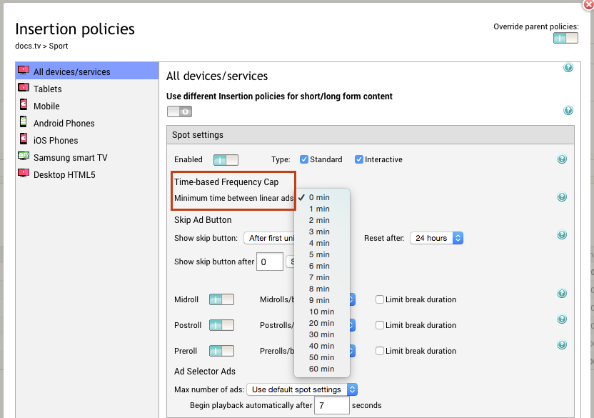

# 2016-10-07 Release

Ability to choose from a wider time range for time-based frequency cap in ad insertion policies.

## Wider Time Range for Time-based Frequency Cap between Linear Ads

The "Time-based Frequency Cap" capability in the insertion policy settings has been extended. Previously, the minimum time between linear ads could only be set within a time range of zero to 10 minutes. Now, you can also choose to set it to 20, 30, 40, 50 or 60 minutes.

To set or adjust the number of minutes that have to pass before any linear ad can be shown to a viewer again, go to Account and open the Insertion policies page for the desired category/subcategory.

## Documentation Releases

This release includes the following documentation updates:

-   [Ad Insertion Policies](../ad_serving/ug/ad_insertion_policies.md)

## Subscribe to Ooyala Release Notes

See [Subscribe to Ooyala Release Notes](../../concepts/release_notes_subscribe.md) for instructions on how to subscribe for automated notifications of Ooyala release notes.

**Parent topic:**[2016 Video Advertising Release Notes](../../oadtech/relnotes/adtech_relnotes_2016.md)

