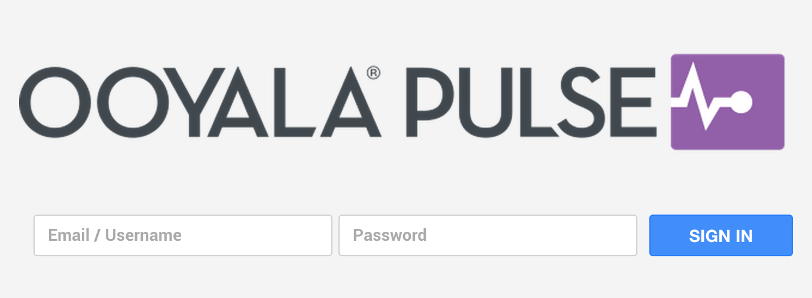
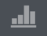

# Getting Started

## Log In

To start using Ooyala Pulse you require a username and password, which should be supplied to you by your designated Strategic Account Manager \(SAM\). If you do not have these login details, please contact your SAM.

To get access to Ooyala Pulse, go to this URL: http://manager.videoplaza.com.

If you need additional assistance in using Ooyala Pulse you can also consult our [Ooyala Community](http://community.ooyala.com/).

## Menu Bar

|Icon|Description|
|----|-----------|
||**Pulse Icon**Check the Video Advertising Release Notes on the Support Centre.|
||**Dashboard**Get a fresh update of the performance of your account.|
||**Campaigns**Create new campaigns, manage all your current and upcoming campaigns, generate campaign reports and get campaign delivery notifications.|
||**Planner**Create inventory and campaign simulations.|
||**Insight**Manage your reports.|
||**Account**Add content categories, content partners and customize ad insertion policies.|
||**Clients**Associate campaigns with advertisers, agencies and brands, and enable clash protection.|
||**Asset Factory**Generate video files to run on any device of your choosing, view the transcoding process and a list of all uploaded files.|
||**Settings**Personalise your ad delivery, video player experience and the Pulse user interface.|
||**Help**Visit the Ooyala Support Centre.|
||**Log Out**Log out of your Pulse account.|

**Parent topic:**[Ooyala Pulse User Guide](introduction.md)

